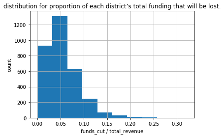
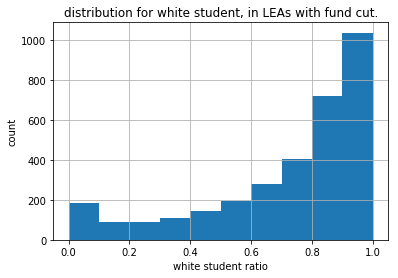
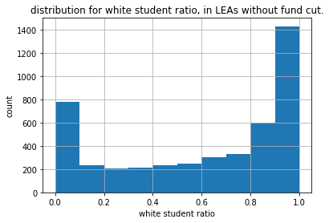
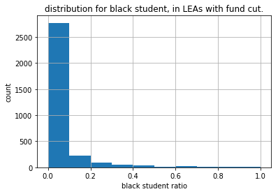
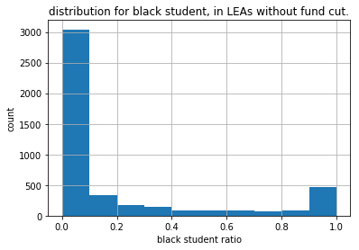
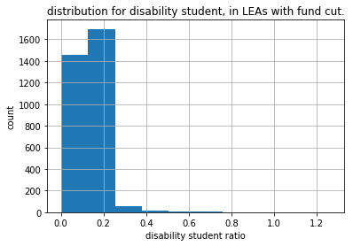
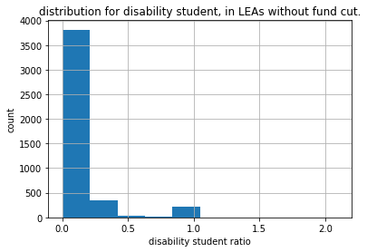

Q1

plot:

 

insight: most LEA districts only lose a minor proportion of fundings.( <0.1) 

According to table below: LEA ID 400893, 2680850, 2680850, 4676680, 400190 and 400235 has most  proportion of fundings cut.

LEAID   cut_ratio

400893   0.321930

2680850   0.294253

4676680   0.274355

400190   0.264271

400235   0.251383

Q2

From distributions, LEA districts with fund cut tend to have a little more proportion of white students, than those without fund cuts

 

 

LEA districts with fund cut tend to have a little less proportion of black students, than those without fund cuts

 

Those facts mean that my selection managed to avoid the bias here.
That's because my selection tried to give poor people a better education.

Q3:

From distributions, LEA districts with fund cut tend to have a little less proportion of disability students, than those without fund cuts

 

Those facts mean that my selection managed to avoid the bias here.
That's because my selection tried to give poor people a better education.

Q4

analyze this solution: https://github.com/stiangithub/HW3

He used a 15% cut for all schools.
His justification is: if we are gonna cut from districts with high budget per students, it maybe unfair since these districts maybe due to some reasons need more helps.

Advantage:
simple to calculate and allocate

Disadvantage:
did not take education imbalance into consideration. We can cut funds from schools with "enough" funds, by first getting schools with enough proportion of non-federal funds and then getting schools with poor education, like my solution did.

Q5:

I learned that although mapreduce is being replaced by in-memory big data framework like spark, it is still in use due to many reasons.
1: historic reasons
2: legacy codes
3: in some non-iterative computing, while I/O to/from disk is not such a significant need, mapreduce can still be fast. Also, disks are cheaper than memories anyway.